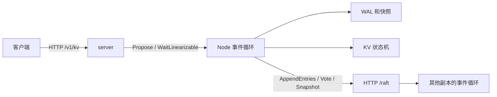
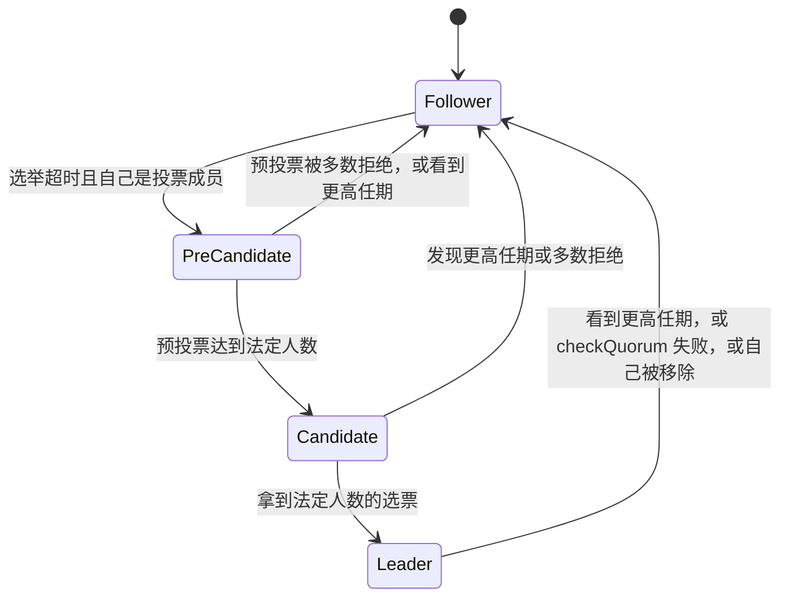
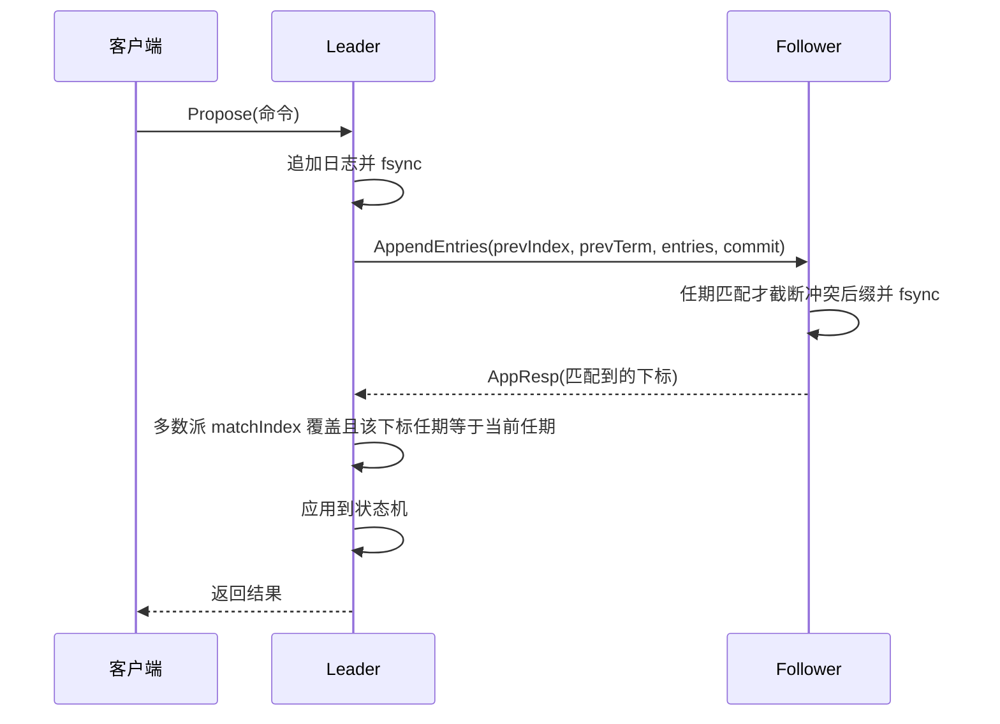

# Keelstone 设计

Keelstone 给内部微服务做配置中心和元数据存储。功能开关、灰度比例、路由表都以键值写入，由单个 Raft 组复制。要求强一致：即使挂掉一个节点，读到的也必须是已提交的配置，不能是过期值。

这是一个单 Raft 组的内存键值存储。选举、复制、持久化、快照、线性读和成员变更都在本仓库实现。算法来自 Raft 论文和 Ongaro 的学位论文（PreVote、ReadIndex、一次改一台成员）。没有链接 etcd 或 Hashicorp 的 Raft 库，类型和代码都是自己的。对照关系写在 README 的 References。

## 总览

一个进程里有三样东西：

- `internal/raft.Node`：单线程事件循环，拥有任期、投票、日志、commitIndex。
- `internal/kv.Machine`：确定性状态机。只有事件循环调用 `Apply` / `Snapshot` / `Restore`。`Get` 可以在 ReadIndex 成功之后由别的 goroutine 调用，所以状态机自己有锁。
- `internal/server`：HTTP。复制走 `POST /raft`，客户端走 `/v1/kv`。

选 HTTP 而不是 gRPC，是为了能用 curl 看到每一条消息。`raft.Message` 的字段和一次 RPC 一一对应，换成 protobuf 不改变协议。

## 为什么是单线程

`Node.loop` 是唯一能改 Raft 状态的地方。外部只往 `inbox`、`propC`、`readC` 投事件。投票和日志只在这个循环里改，不靠另一把锁把它们隔开。

代价是网络不能堵在这个循环里。`transport.HTTP.Send` 把 POST 放到另一个 goroutine。对端收到后 `Deliver` 进信箱；信箱满了就丢，下一轮心跳会补。

## 角色

`PreCandidate` 对应学位论文 9.6 节。预投票的请求任期是 `term+1`，但收到预投票**不会**把本地 term 抬高，也不会把 `votedFor` 写盘。只有预投票已经表明「如果我真的自增任期，法定人数会投我」，才进入 `becomeCandidate` 把 term 加一。

拒绝预投票的条件在 `handlePreVote`：

- 对方的预期任期并不比我高；
- 我自己是 leader；
- 或者我在本轮选举超时内听到过现任 leader。

被分区的节点因此不会一轮一轮地把集群的 term 抬上去。

## 选举限制

`raftLog.upToDate` 按论文 5.4.1：先比最后一条日志的任期，任期相同再比长度。当选者一定持有所有已经提交的日志，所以提交点不会在换主时丢掉。

真正投票时，`votedFor` 和 term 通过 `persistHard` 落盘之后才回复。重启后同一个 term 不会投给第二个人。

## 日志复制

Follower 在 `handleAppend` 里做论文 Figure 2 的一致性检查：

1. `prevLogIndex` 处的任期必须等于 `prevLogTerm`，否则拒绝，并带上 `RejectHint` 和 `ConflictTerm`。
2. 已有且任期相同的前缀跳过。
3. 第一次任期冲突时，从冲突下标把后缀全部截掉，再接上 leader 的后缀。
4. 先 `fsync`，再回复。回复里的 `Index` 是这条消息覆盖到的位置，**不是** follower 自己的 `lastIndex`。Follower 可能还留着旧 leader 的多余后缀，用 `lastIndex` 会让 leader 误以为那些记录已经对齐。

Leader 每个 follower 有一个 `progress`：`next`、`match`、`probe`。探测模式（`MaxInflight == 1`，也是流水线建立之前的行为）一次只发一条，只认最新的 `probe`。心跳重发会把 probe 加一，迟到的旧响应直接忽略，避免「先发出去的失败响应把 nextIndex 又减回去」。

`MaxInflight > 1` 时，第一条 AppendEntries 成功之后进入复制模式：`next` 按已经发出的下标往前走，窗口里可以同时有多条消息。后到的成功响应只要 `Index` 更大就推进 `match`。如果后发出的消息先到、follower 因为 prev 还没写上而拒绝，就把它当成乱序，把 `next` 拉回缺口，等前一条的成功再继续发，不把整条流水线打回探测。真正的日志冲突（没有更早的在途消息）才退回一次一条的探测，并用 `ConflictTerm` 跳过整段任期。几个心跳都没有回包则认为在途消息丢了，同样退回探测，从 `match+1` 重发。这样窗口不会因为一次丢包永远占满。

`RejectHint` 是 follower 建议的下一个下标。如果冲突任期在 leader 的日志里也存在，leader 直接跳到该任期的最后一条之后，这就是常见的快速回退，避免一次只退一格。

默认 `MaxInflight` 是 8，`--max-inflight 1` 一直停在探测模式。窗口大于 2 之后，节点之间的 HTTP 不能再用默认「每个 host 只留 2 条空闲连接」，否则多出来的 AppendEntries 会反复握手。`transport.HTTP` 把空闲连接池调到 `MaxIdleConns=128`、`MaxIdleConnsPerHost=64`。探测模式里不要每个心跳都重发那条还在途的消息：快照很大、后面又有新日志时，重发会把已经发出的快照探针作废，follower 的快照确认永远对不上。

容器压测（`docs/benchmark-realistic.md`）说明这个窗口解决的是哪一段。三副本各限 0.5 CPU，中间有真实的单向延迟。优化前是单飞复制：YCSB A（50% 写）同机房 2660.84 op/s、写 P99 89.862 ms，跨区 1497.51 op/s、写 P99 143.321 ms，而且两次都有客户端超时。窗口开到 8 之后，同机房 A 到 6034.69 op/s、写 P99 51.451 ms，跨区 A 到 4766.91 op/s、写 P99 38.676 ms，错误都变成 0。跨区 ping 的平均 RTT 只有 4.699 ms，写的 P99 却是几十毫秒，所以慢的不是「一个 RTT 一次写」，而是 64 个客户端堆在一条在途复制上，再加上每次提交的 fsync。

YCSB B（95% 读）不是同一个瓶颈。同机房开窗口之后吞吐从 10876.10 降到 8683.77 op/s，总 P99 几乎不动（48.102 → 47.083 ms）。读多的时候卡在 ReadIndex 和 0.5 个 CPU，多出来的复制消息只是多占 leader。跨区 B 的写仍然吃 RTT，窗口把写 P99 从 86.789 ms 降到 18.481 ms，总吞吐 6595.78 → 7390.88 op/s。

## 提交规则（Figure 8）

`maybeCommit` 把投票成员的 `matchIndex` 从大到小排，取第 `quorum` 个。只有这个下标上的日志**任期等于当前任期**才允许提升 `commitIndex`。

旧任期的日志即使已经被多数派复制，也不能就地提交。论文 Figure 8 的反例是：旧 leader 的日志被复制到了多数，但它还没提交就下台；新 leader 没有这条日志，后来又写了一条同下标的新记录。如果有人按「复制到多数」提交了旧记录，状态机会分叉。

所以 `becomeLeader` 立刻追加一条当前任期的 `EntryNoop`。这条 noop 一旦按上面的规则提交，它前面的旧日志作为前缀一起变成已提交，并在 `apply` 里顺序执行。

## 持久化

目录里三个文件，格式是本项目自己的，不是 etcd WAL：

| 文件 | 内容 | 写法 |
|---|---|---|
| `hardstate` | term、vote、commit | 临时文件 + fsync + rename |
| `wal` | entry 和 truncate 记录，带 CRC | 追加，返回前 fsync |
| `snapshot` | 快照下标、任期、成员、状态机字节 | 同样原子替换 |

`HardState.Commit` 不是论文 Figure 2 的必存字段。存下来之后，重启可以自己重放 `(snapshot, commit]`，不用干等新 leader。

恢复顺序：

1. 读快照，状态机 `Restore`。
2. 重放 WAL。CRC 对不上的文件尾当成崩溃时没写完的记录丢掉。
3. 丢掉下标 `<= snapIndex` 的日志。
4. 把已提交的命令再 `Apply` 一遍。请求号缓存在快照里，重放不会做两次。

崩溃窗口：先 fsync 日志，再 fsync 新的 commit，再应用到内存。崩在中间的话，重启用日志把状态机补齐。

## 快照

日志条数达到 `SnapshotEntries` 时，`takeSnapshot` 在 `lastApplied` 处切：

- 状态机 `Snapshot()` 必须正好是这个下标的状态，因为应用是同步的，切快照时没有并发的 Apply。
- 快照里的投票成员是 `configAt(lastApplied)`，不含还没提交的配置。
- 内存日志只留后缀。WAL 重写成只含这些后缀。

`handleSnap` 拒绝 `snap.Index <= commitIndex` 的快照。否则一个落后的快照会把已经应用的状态机倒回去。落后的 follower 则整段安装；如果本地恰好有同一下标、同一任期的日志，保留它后面的后缀。

快照一次发完，没有分片。日志很大时这条消息会很大，这是当前实现的限制。

## 线性读：ReadIndex

用的是 ReadIndex，不是 lease。Lease 要假设时钟误差有上界。时钟跳变或长时间停顿时，旧 leader 可能在新 leader 已经提交配置之后继续对外读，客户端就会拿到过期配置。ReadIndex 只依赖法定人数，和复制走的是同一套消息。挂掉一个节点之后，剩下的多数派仍能确认读；凑不齐法定人数的旧 leader 完不成 ReadIndex。

`WaitLinearizable` 的步骤：

1. 不是 leader 就返回 `ErrNotLeader`，调用方去别的节点。
2. 本任期的 noop 还没提交则先排队。否则一个刚上任、还没确认过日志的 leader 可能读到后来会被新 leader 覆盖的状态。
3. 记下 `readIndex = commitIndex`，自己算一张确认票。
4. 广播 AppendEntries，`Context` 带上这一轮的 id。已经在飞的一轮会被后来的读搭车，所以并发读只多一轮法定人数心跳。
5. 投票成员的成功响应计入确认。失败的（日志还没对齐）不算。
6. 确认数达到法定人数，且 `lastApplied >= readIndex` 之后才放行。
7. HTTP handler 再 `Machine.Get`。通道收发保证这次 Get 能看见已经应用的写。之后如果又应用了更新的写，读到新值仍然是线性一致的。

`checkQuorum` 让一个收不到多数心跳的 leader 在大约一个选举超时后下台。被分区的旧 leader 既完不成 ReadIndex，也不会一直对客户端自称 leader。`TestLeaderIsolationElectsNew` 检查了这一点：隔离之后旧 leader 的线性读必须失败。

## 状态机和幂等

写操作是 `put` / `delete` / `cas` / `add`。`add` 用来确认同一个请求号不会执行两次：put 是覆盖写，重复应用看不出差别，计数会。Get 不进日志。

每条命令带 `client_id` 和单调的 `request_id`。状态机为每个客户端保存全部见过的结果（同时记在快照里）。重复的请求号直接返回第一次的 `Result`，不改数据。

客户端在一次调用的所有重试里复用同一个请求号（`internal/client`）。因此：

- leader 在回复之前崩溃，但日志后来被提交：重试拿到缓存的结果；
- 日志被新 leader 截掉了：重试会真正执行一次。

调用方自己的超时不能当成「一定没写上」。测试里把这种未知结果留到集群静止之后，用 `Machine.Recall` 去对。见下面的测试一节。

## 成员变更

一次只允许一条未提交的配置日志，所以不用 joint consensus。操作分三步，避免「加一台投票成员就要求它立刻参与法定人数」：

| 操作 | 对法定人数的影响 |
|---|---|
| `add_learner` | 没有。新节点只收日志 |
| `promote` | 加一台投票成员。调用方应先等它追上 |
| `remove` | 去掉一台。不能移除最后一个投票成员 |

当前法定人数用的是日志里**最新**的配置，包括还没提交的那条（`configAt(lastIndex)`）。这是学位论文里一次改一台的规则：配置条目一旦写进日志就生效，靠「相邻两套配置只差一台，多数派仍然相交」来保证安全。同时只放一条未提交配置，是这个论证的前提。

Leader 把自己移除且该条目提交之后，`apply` 里会下台，并且因为它不再是投票成员，不会再发起选举。

## 故障注入和线性一致性

`internal/cluster.FaultNet` 在进程内投递消息，可以：

- 按节点分区（不同 group 互相丢）
- 按概率丢包
- 延迟，延迟本身会打乱顺序
- 标记崩溃；`MemoryStorage` 留下来模拟「进程没了，磁盘还在」

历史用 [Porcupine](https://github.com/anishathalye/porcupine) 检查，模型在 `internal/lincheck`。操作按 key 切开，每个分区的状态就是这一个键。这样 100 来条操作也不会把 NP 检查跑爆。

超时的写在集群重新收敛之后处理：

- `Recall` 找到了这个请求号：它提交过。输出改成真实结果，返回时间延长到观察到它的时刻。
- 所有副本都没有：它没提交，从历史里拿掉。

已经成功返回的读写仍用原来的时间区间。所以「写已经响应，之后的读却看不见」这种错误还是会被判非法。`TestStaleReadIllegal` 就是这个模型的反例。

延长未知操作的返回时间，有可能掩盖「超时之后的读没看到其实已经提交的写」。这是未知结果本身的信息不够，不是把成功操作放水。

## 安全论证

1. **选举安全**：一个 term 最多一个 leader。投票先落盘，且每个节点每个 term 只投一张票；法定人数两两相交。
2. **Leader 完整性**：当选者的日志至少和法定人数里任意一个一样新，因此含有所有已提交记录。
3. **状态机安全**：`apply` 只按 commitIndex 顺序执行；commitIndex 只增不减；快照不能装到 commitIndex 以下。
4. **只在当前任期提交**：`maybeCommit` 检查任期，noop 把旧前缀带过提交点。
5. **线性读**：ReadIndex 的法定人数心跳和任何新 leader 的选举法定人数相交，所以在确认的那一刻不存在另一个 leader。读到的状态至少包含当时的 commitIndex。

## 取舍

| 选择 | 换到的东西 | 放弃的东西 |
|---|---|---|
| 事件循环而不是 etcd 的 Ready/Advance | 持久化顺序就写在发送旁边 | 核心和网络、磁盘拆得没那么开 |
| ReadIndex，读请求搭同一轮心跳 | 不依赖时钟 | 每次读至少一轮法定人数 RTT（并发的可以合并） |
| 每次提交都 fsync | 崩溃后不丢已确认的写 | 写吞吐被磁盘同步卡住，见 benchmark |
| 先 learner 再 promote | 加节点时法定人数不变，集群不会因为新节点还是空的就停写 | 多一次配置日志 |
| 一次改一台 | 不用 joint consensus，好讲 | 不能一批增删多台 |
| 快照整包发送 | 代码短 | 大状态机时一条 RPC 很大 |
| 默认每个 follower 最多 8 条在途 AppendEntries，`--max-inflight 1` 退回探测 | 延迟高于 fsync 时，一个 RTT 里可以发出多批日志 | 乱序会把窗口暂时拉回；实现比单飞长 |
| 请求号全保留 | 幂等和测试对账都简单 | 会话表会一直涨，生产系统要裁剪 |

## 已知限制

- 没有 TLS、认证、多 Raft group。
- 没有租约读、没有 leadership transfer。
- 配置变更不会自动在追上之后 promote，调用方自己等 `Applied`。
- `promote` 写进日志之后，新投票成员就进入法定人数。它如果还很落后，提交会停在这一条上，直到它确认。
- 快照和日志都是 JSON，图的是可读，不是极限性能。
